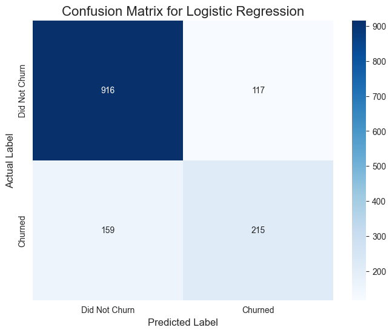

# Customer Churn Prediction (SQL & Machine Learning)

### A project to analyze and predict customer churn using SQL and a Logistic Regression model.


## Project Overview

This project tackles the critical business problem of customer churn. It demonstrates a complete data science workflow, from sourcing data using **SQL** to building a **binary classification model** to predict which customers are likely to leave.

The key differentiator of this project is the integration of a local SQLite database, showcasing the ability to work with data in a more realistic, database-centric environment rather than relying solely on CSV files.

## Key Objectives

*   To demonstrate proficiency in using **SQL** to query data for analysis.
*   To preprocess and prepare a real-world dataset for machine learning.
*   To build and train a **Logistic Regression** model to predict customer churn.
*   To evaluate the model's performance using key classification metrics like Accuracy, Precision, Recall, and the Confusion Matrix.

## Dataset & Database

The dataset used is the "Telco Customer Churn" collection from Kaggle. The raw CSV data was loaded into a local **SQLite database** (`telco_churn.db`), and all analysis was performed on data queried from this database.

**Data Preprocessing Steps:**
*   Handled and imputed missing values in the `TotalCharges` column.
*   Converted the binary `Churn` target variable into a 0/1 format.
*   Applied **One-Hot Encoding** to all categorical features to prepare them for the model.
*   Used **stratification** during the train-test split to handle class imbalance.

## Model Performance

The trained Logistic Regression model achieved the following results on the unseen test data:
*   **Accuracy:** **~81%** (The model correctly predicts the churn status for 4 out of 5 customers).
*   **Precision:** **~66%**
*   **Recall:** **~56%**

## Technical Stack

*   **Language:** Python 3.13
*   **Database:** SQLite
*   **Libraries:**
    *   Pandas & NumPy for data manipulation.
    *   Matplotlib & Seaborn for data visualization.
    *   Scikit-learn for building and evaluating the classification model.
*   **Environment Management:** `uv`

## How to Run This Project

1.  **Clone the repository:**
    ```bash
    git clone https://github.com/YOUR_USERNAME/customer-churn-prediction.git
    cd customer-churn-prediction
    ```
2.  **Create a virtual environment and install dependencies:**
    ```bash
    uv venv
    source .venv/bin/activate
    uv pip install -r requirements.txt
    ```
3.  **Run the initial setup cell in the notebook** to create the SQLite database from the raw CSV.
4.  **Run the remaining cells** to perform the analysis and model training.

## Visualizations Showcase


*The confusion matrix for the Logistic Regression model, showing its performance in predicting True Positives, True Negatives, False Positives, and False Negatives.*